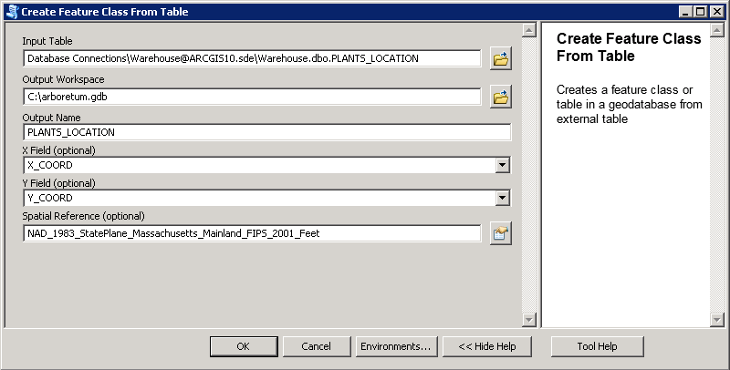
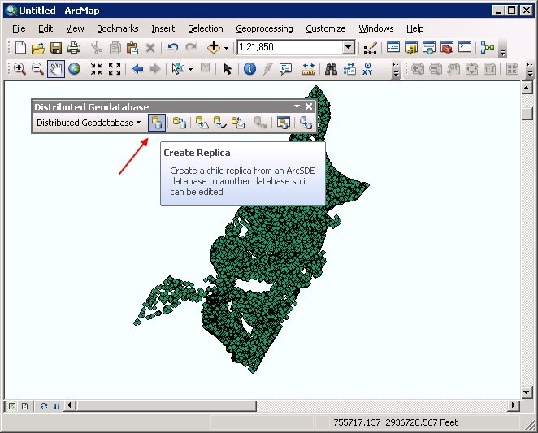
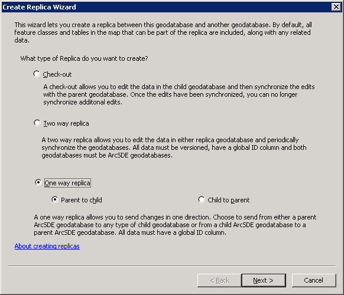
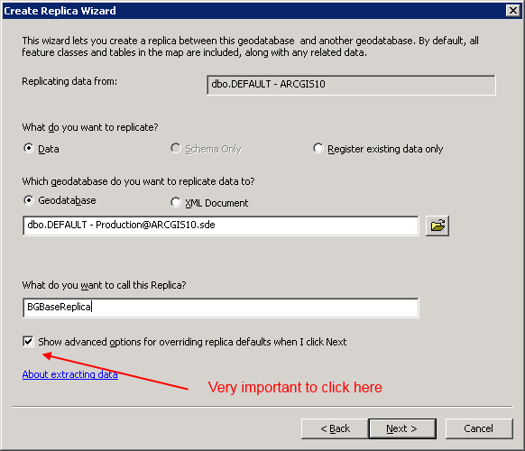
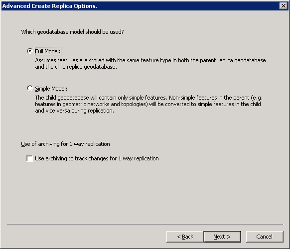
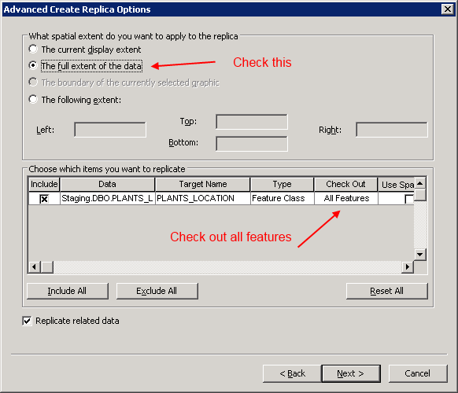
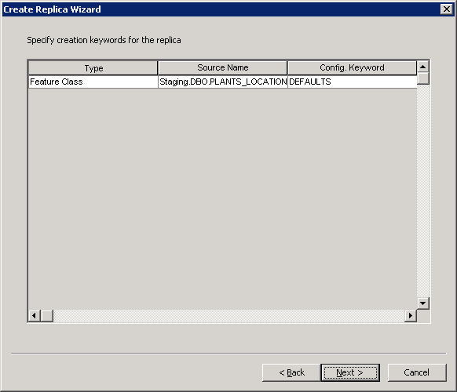
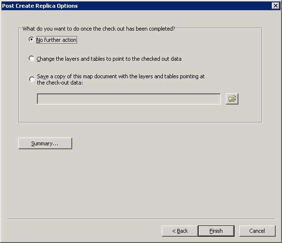

##Arnold Arboretum BGBASE - SQL Server Connector
###Overview
The Arnold Arboretum BG-BASE - SQL Server Connector, referred to as *Connector* from here on out, is a library that is written in Python to faciliate the movement of data
bewtween the Arboretum's BGBASE database and its ArcGIS SDE database. The Connector contains 2 files that are launched from the Python executable
to move the Arboretum's data: **_sqlserver_to_sde.py_** and **_sde_to_xml.py_**. The code is controlled by a configuration file, **_config.py_**, that indicates
where various data sources exist, as well as other settings, such as the location of log files.

Connector uses Python 2.7, the 32-bit Python ODBC client (pyodbc) to interact with the Warehouse database and the ArcGIS Python library (arcpy) to interact with the ArcGIS database.

###General System Architecture
The Connector is made up of multiple systems. Arnold Arboretum uses BG-BASE to maintain its plant information, and uses ArcGIS Server to make its data spatially available.
A non-spatial database sits in between the BG-BASE database and ArcGIS database that is critical in getting the changes from BG-BASE to ArcGIS. This non-spatial database
is a SQL Server database, and the database is configured to use Change Data Capture (CDC) to track changes.

BG-BASE and the Arnold Arboretum designed a relational database in SQL Server that is a representation of the BG-BASE data. This database is named **Warehouse**.
When changes are made in the BG-BASE database, the BG-BASE software will replicate these changes in the Warehouse database using an ODBC connection. The tables
that are updated in Warehouse must have CDC enabled in order for the changes to propagate to ArcGIS. When called using the **sqlserver_to_sde.py** code,
the Connector will read the changes from the CDC tables, and will apply the changes from the Warehouse database to the ArcGIS database.

The Connector requires an ArcGIS Geodatabase Replica in order to propagate changes from the spatial database to the BG-BASE database. The replica is a one-way
replica, with changes moving from the parent replica to the child replica. In the Arboretum's system, the parent replica is contained in a database named **Staging**,
and the child replica is contained in a database named **Production**. Users make edits in the Staging geodatabase, and then run the Connector's **sde_to_xml.py**
code that will generate an XML data change file and place the file in a location that is known to BG-BASE. BG-BASE will pick up the change file, and will update
the internal BG-BASE database.

*It is important to note that the Connector only supports updates that are made in the ArcGIS database. New records from ArcGIS will not be applied to BG-BASE.*

###Code Structure
Connector has the following code structure:

* *config.py*: This top level file is a Python dictionary that configures the Connector.
* *sde_to_xml.py*: This top level file loads the Connector API to generate the XML change file for changes that originated in the geodatabase.
* *sqlserver_to_sde.py*: This top level file loads the Connector API to import changes that originated in BG-BASE into the geodatabase.
* *connector*: Package containing the implementation files of the Connector API.
	* *db.py*: File that contains Python classes that encapsulate database functionality.
		* *Replicas*: Python class that parses replicas from the config file.
		* *Replica*: Python class that encapsulates a replica. A replica contains an array of Datasets and manages the ODBC connection to the SQL Server.
		* *Dataset*: Python class that encapsulates a dataset. A dataset has a properties for a SQL Server table and a geodatabase dataset. The dataset class also contains functions that are used to read and parse data changes from the SQL Server CDC tables.
	* *io.py*: File that contains Python classes that encapsulate import and export functionality of the Connector.
		* *SqlServerImporter*: Python class that is called by the sqlserver_to_sde to import changes from the CDC tables into the geodatabase.
		* *GeodatabaseExporter*: Python class that is called by the sde_to_xml to generate an XML change file between geodatabase replicas.
	* *util*: File containing utility classes.
		* *DBUtil*: Python class that provides helper functions for ODBC objects.
		* *DateUtil*: Python class that provides helper functions for Date/Time objects.
		* *LockFile*: Python class that helps the Connector from running in multiple instances.

###Data Preparation
First, a SQL Server instance of the BG-BASE database must be created. **_Donna, is this standard functionality within BG-BASE? Or is this custom per client with help from BG-BASE?_**
TODO: Finish this portion.

Once the data is ready in Warehouse, CDC must then be enaled per table that is to be managed in ArcGIS. **_Donna, this is where you can add your CDC notes._**.

Next, a spatial representation of the tables that are to be maintained in ArcGIS must be created in a Geodatabase. There is an ArcGIS Python Toolbox in the repository,
located at toolboxes\SpatialDataCreation.pyt. The toolbox contains a tool named "Create Feature Class From Table" that will create a feature class based on X and Y fields.
Below is a screenshot of the inputs to the tool:

Once your spatial data is ready, you must then create a geodatabase replica so that changes that are made in ArcGIS are propagated to BG-BASE. You can find instructions for creating
replicas [here] (http://resources.arcgis.com/EN/HELP/MAIN/10.2/index.html#//003n000000tm000000). Below are screenshots from creating the replica at the Arnold Arboretum.

Step 1: Open ArcMap, add the spatial data from SDE to ArcMap and on the Distributed Geodatabase toolbar, click the "Create Replica" button.

Step 2: Choose the "One way replica" option, with the "Parent to child" option.

Step 3: Enter a name for your replica. _Be sure to check the "Show advanced options" checkbox before pushing next._

Step 4: Choose your model type.

Step 5: Enter the advanced options for the replica. Be sure to check "The full extent of the data" option. In the grid control that lists the datasets that are
participating in the replica, be sure that the "All Features" select box is selected in the "Check Out" column.

Step 6: Specify the SDE keywords for the replica.

Step 7: Press the Finish button to create the replica.

###Configure the Connector
**_Jason TODO: Describe the contents of the connector_**